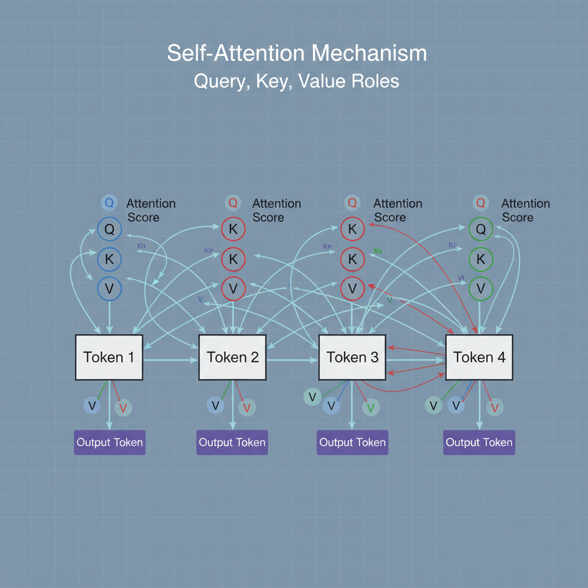
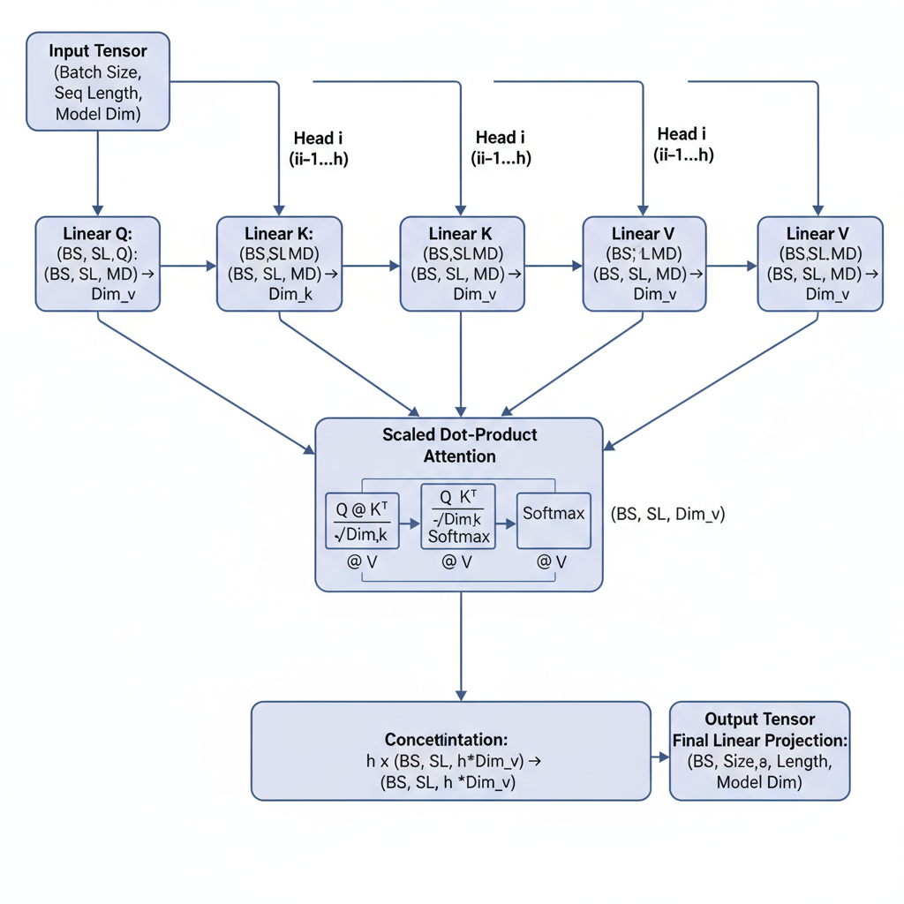
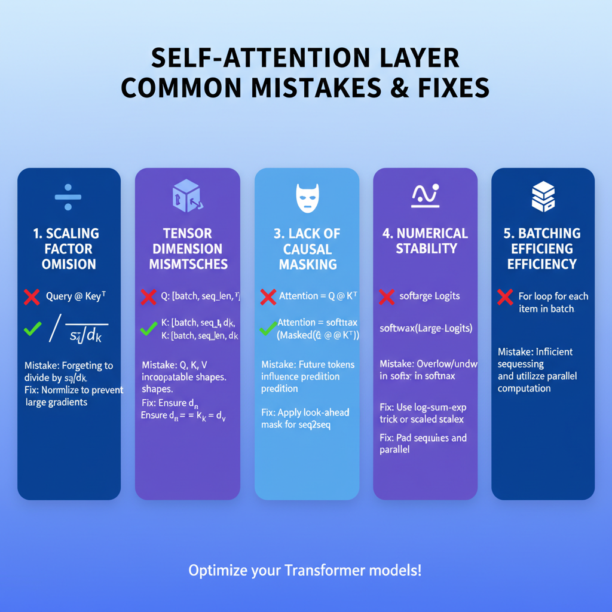

# Understanding the Self-Attention Mechanism in Transformers

## Introduction to Self-Attention in Transformers

Traditional sequence models like Recurrent Neural Networks (RNNs) and Long Short-Term Memory networks (LSTMs) have been foundational in processing sequential data such as text or time series. However, these models face significant limitations when modeling long-range dependencies. Their sequential nature means information must be passed step-by-step through each time step, which leads to vanishing or exploding gradient issues and makes it challenging to capture relationships between distant elements efficiently.

Attention mechanisms were introduced to address these challenges by allowing models to weigh the relevance of different parts of the input sequence directly. Instead of processing tokens sequentially, attention enables the model to look at the entire sequence and dynamically focus on the most pertinent tokens when producing each output token. This approach alleviates the bottleneck of relying solely on the previous hidden state to convey context.

The Transformer architecture builds on this concept by replacing recurrence entirely with a stack of self-attention layers combined with position-wise feed-forward networks. Within each Transformer block, self-attention computes the relevance of every token to every other token in the sequence. This explicitly models all pairwise interactions, enabling rich context aggregation. Positional encodings supplement this by injecting order information that self-attention itself lacks.

One of the key advantages of self-attention in Transformers over RNNs/LSTMs is the ability to process input tokens in parallel rather than sequentially. Because each token attends to all others simultaneously, training and inference can fully leverage modern hardware accelerators like GPUs/TPUs, greatly improving efficiency. Additionally, this full connectivity facilitates better global context understanding, which is crucial for tasks requiring compositional or long-distance reasoning.

In summary, self-attention in Transformers overcomes traditional sequence modeling limitations by enabling:

- Direct modeling of long-range token dependencies without gradient degradation
- Parallel computation across all tokens, enhancing training speed
- Comprehensive context integration from the entire sequence simultaneously

This innovation forms the backbone of many state-of-the-art results in natural language processing and beyond.

## Core Concepts of Self-Attention

The self-attention mechanism is the foundation of transformer architectures, enabling each token in the input sequence to dynamically attend to all other tokens. It operates through three key matrices: queries (Q), keys (K), and values (V).

### Queries, Keys, and Values

Given an input sequence represented as embeddings \( X \in \mathbb{R}^{T \times d_{model}} \) where \(T\) is the sequence length and \(d_{model}\) is the embedding dimension, the Q, K, and V matrices are computed by linear projections:

\[
Q = XW^Q, \quad K = XW^K, \quad V = XW^V
\]

Here,

- \(W^Q, W^K, W^V \in \mathbb{R}^{d_{model} \times d_k}\) are learned projection matrices,
- \(d_k\) is the dimensionality of the queries and keys, typically \(d_k = d_v = d_{model} / h\) for \(h\) attention heads.

Each token transforms into a query vector, a key vector, and a value vector, all in \(d_k\)-dimensional space. This separation allows the model to calculate attention weights by comparing queries to all keys.

### Scaled Dot-Product Attention

The core computational step is the scaled dot-product attention, which outputs a weighted sum of values, where the weights reflect the similarity between queries and keys:

\[
\text{Attention}(Q, K, V) = \text{softmax}\left(\frac{QK^T}{\sqrt{d_k}}\right) V
\]

- The dot product \(QK^T\) computes pairwise similarities across all tokens.
- Dividing by \(\sqrt{d_k}\) scales the scores, preventing large magnitude dot products that can push softmax into regions with very small gradients and slow training.
- The softmax normalizes scores along the keys' axis to sum to 1, forming valid attention distributions.

### Minimal Working Example

Here is a minimal PyTorch-style sketch illustrating the self-attention calculations for one single-head attention:

```python
import torch
import torch.nn.functional as F

# Inputs: batch_size=1, seq_length=3, d_model=4
X = torch.tensor([[1., 0., 1., 0.],
                  [0., 2., 0., 2.],
                  [1., 1., 1., 1.]]).unsqueeze(0)  # shape: (1, 3, 4)

# Learned projection matrices (random for demonstration)
W_Q = torch.randn(4, 2)
W_K = torch.randn(4, 2)
W_V = torch.randn(4, 2)

Q = X @ W_Q  # shape: (1, 3, 2)
K = X @ W_K  # shape: (1, 3, 2)
V = X @ W_V  # shape: (1, 3, 2)

# Scaled dot product attention
d_k = Q.size(-1)
scores = Q @ K.transpose(-2, -1) / (d_k ** 0.5)  # (1, 3, 3)
weights = F.softmax(scores, dim=-1)               # (1, 3, 3)
output = weights @ V                               # (1, 3, 2)

print("Attention output:\n", output)
```

This computes attention weights for each token attending over all tokens and then applies these weights to aggregate the values, resulting in a transformed output.

### Efficiency Considerations

- **Batching:** Self-attention computations leverage batch matrix multiplications (e.g., `torch.bmm`) to process multiple sequences simultaneously, fully utilizing GPU parallelism.
- **Parallelism:** Since attention involves dense matrix multiplications, it's highly amenable to GPU acceleration. Frameworks optimize these operations using libraries like cuBLAS.
- **Memory:** Computing attention for long sequences can be memory-intensive (\(O(T^2)\) complexity); techniques like sparse attention or windowed attention reduce this cost.

### Output Shape and Multi-Head Attention

- The output of single-head attention has shape \((batch\_size, seq\_length, d_v)\).
- In multi-head attention (with \(h\) heads), each head computes attention independently with dimensionality \(d_k = d_v = d_{model}/h\).
- The outputs from all heads are concatenated along the embedding dimension, yielding a tensor of shape \((batch\_size, seq\_length, d_{model})\).
- A final linear projection maps this concatenated tensor back to the model dimension, enabling the model to capture diverse representation subspaces and richer contextual embeddings.

---

This mathematical formulation and computational workflow enable transformers to flexibly encode context across tokens, with parallelizable operations well-suited for high-performance execution on modern hardware.


*Visual representation of the self-attention process where each token attends to every other token in the sequence.*

## Implementing Multi-Head Self-Attention from Scratch

Multi-head self-attention allows transformers to jointly attend to information from different representation subspaces. Let's walk through how to implement a simplified version step-by-step.

### 1. Splitting Input Embeddings into Multiple Heads

Given an input tensor `X` of shape `(batch_size, seq_len, embed_dim)`, we first split the embedding dimension into `num_heads` separate heads. Each head operates on a subspace of size `head_dim = embed_dim // num_heads`.

To do this efficiently, reshape `X` to `(batch_size, seq_len, num_heads, head_dim)` and then transpose to `(batch_size, num_heads, seq_len, head_dim)` for parallel computation:

```python
import torch

batch_size, seq_len, embed_dim = 2, 5, 64
num_heads = 8
head_dim = embed_dim // num_heads

# Example input tensor
X = torch.rand(batch_size, seq_len, embed_dim)

# Step 1: reshape and transpose for multi-heads
X_heads = X.view(batch_size, seq_len, num_heads, head_dim).transpose(1, 2)
# X_heads shape: (batch_size, num_heads, seq_len, head_dim)
```

### 2. Computing Q, K, V for Each Head and Scaled Dot-Product Attention

We apply three learnable linear projections (weight matrices) to `X` to generate queries (Q), keys (K), and values (V) for each head:

```python
from torch import nn

# Linear layers to project X into Q, K, V
W_q = nn.Linear(embed_dim, embed_dim)
W_k = nn.Linear(embed_dim, embed_dim)
W_v = nn.Linear(embed_dim, embed_dim)

Q = W_q(X)  # shape: (batch_size, seq_len, embed_dim)
K = W_k(X)
V = W_v(X)

# Split into heads
Q = Q.view(batch_size, seq_len, num_heads, head_dim).transpose(1, 2)
K = K.view(batch_size, seq_len, num_heads, head_dim).transpose(1, 2)
V = V.view(batch_size, seq_len, num_heads, head_dim).transpose(1, 2)
```

Scaled dot-product attention is computed for each head as:

\[
\text{Attention}(Q,K,V) = \text{softmax}\left(\frac{Q K^T}{\sqrt{head\_dim}}\right) V
\]

Implementation:

```python
import torch.nn.functional as F
import math

# Compute scaled dot-product attention per head
scores = torch.matmul(Q, K.transpose(-2, -1)) / math.sqrt(head_dim)
attn = F.softmax(scores, dim=-1)
output = torch.matmul(attn, V)  # shape: (batch_size, num_heads, seq_len, head_dim)
```

### 3. Concatenation and Linear Projection

The outputs from all heads are concatenated back into a single tensor and passed through a final linear layer to mix the information from different heads:

```python
# Concatenate heads
output_concat = output.transpose(1, 2).contiguous().view(batch_size, seq_len, embed_dim)
# shape: (batch_size, seq_len, embed_dim)

# Final linear projection
W_o = nn.Linear(embed_dim, embed_dim)
final_output = W_o(output_concat)
# shape: (batch_size, seq_len, embed_dim)
```

### 4. Example Input and Output Shapes

- Input `X`: `(2, 5, 64)`
- After splitting heads `X_heads`: `(2, 8, 5, 8)`
- Q, K, V shapes: `(2, 8, 5, 8)`
- Attention scores: `(2, 8, 5, 5)`
- Attention output per head: `(2, 8, 5, 8)`
- Concatenated output: `(2, 5, 64)`
- Final output: `(2, 5, 64)`

Verifying shapes at each step helps catch broadcasting and dimension errors early.

### 5. Performance Optimization Tips

- **Caching keys and values**: During inference with autoregressive generation, caching `K` and `V` from previous time steps avoids recomputing them, reducing complexity from \(O(T^2)\) to \(O(T)\) where \(T\) is the sequence length.
- **Batched matrix multiplications**: Use PyTorch's optimized `matmul` with batch and head dimensions for speed.
- **Avoid unnecessary transposes and copies** by controlling tensor memory layouts.

This approach balances simplicity and efficiency, ideal for understanding and building more complex transformer blocks.


*Flow diagram illustrating splitting embeddings into multiple heads, computing queries, keys, values, scaled dot-product attention, concatenation, and final projection with example tensor shapes.*

## Common Mistakes When Using Self-Attention and How to Avoid Them

When implementing self-attention modules, several frequent errors can degrade model performance or cause runtime failures. Addressing these is critical for stable, efficient training and correct results.

- **Omitting the scaling factor:**  
  The dot products between queries (Q) and keys (K) must be scaled by \(\frac{1}{\sqrt{d_k}}\), where \(d_k\) is the key dimension. Without this scaling, the raw dot products can become very large, causing softmax outputs to be extremely peaked. This leads to vanishing gradients and unstable convergence during training. Always include:
  ```python
  scores = torch.matmul(Q, K.transpose(-2, -1)) / math.sqrt(d_k)
  ```
  This maintains gradient stability and smoother learning.

- **Misaligning tensor dimensions between Q, K, V:**  
  Queries, keys, and values must have compatible shapes for matrix multiplication. Typically, Q and K have shape `[batch_size, num_heads, seq_len, d_k]`, and V `[batch_size, num_heads, seq_len, d_v]`. Ensure the `seq_len` and head dimensions align. Common errors include mixing up dimensions or failing to transpose keys correctly, resulting in shape mismatch errors like:
  ```
  RuntimeError: mat1 and mat2 shapes cannot be multiplied
  ```
  Validate tensor shapes at each step and use assertions:
  ```python
  assert Q.shape[-2] == K.shape[-2] == V.shape[-2]
  ```

- **Forgetting to mask future tokens in decoder self-attention:**  
  In autoregressive language models, the decoder’s self-attention must prevent attending to future tokens to avoid data leakage. This is done by applying a causal mask (triangular mask) to the attention scores before softmax:
  ```python
  mask = torch.triu(torch.ones(seq_len, seq_len), diagonal=1).bool()
  scores.masked_fill_(mask, float('-inf'))
  ```
  Omitting this masks allows the model to peek ahead, invalidating training objectives and causing accuracy degradation.

- **Ignoring numerical stability issues in softmax:**  
  Softmax can suffer from overflow when input logits are large. To prevent this, subtract the maximum logit from each score vector before applying softmax:
  ```python
  scores = scores - scores.max(dim=-1, keepdim=True)[0]
  attention_weights = torch.softmax(scores, dim=-1)
  ```
  This clamping improves numerical stability and avoids NaNs during backpropagation.

- **Overlooking performance impact of inefficient batching or non-vectorized operations:**  
  Naively looping over sequences or heads without vectorization drastically slows training and wastes GPU parallelism. Always batch operations across heads and sequences using optimized tensor operations (e.g., `torch.matmul` with appropriate broadcasting). Avoid manual Python loops inside attention calculation. This yields:
  - Faster execution  
  - Lower memory overhead  
  - Better hardware utilization

**Checklist to avoid common errors:**  
- [x] Include scaling factor \(1/\sqrt{d_k}\) in attention scores  
- [x] Confirm tensor shapes for Q, K, V before matmul  
- [x] Apply causal mask in decoder self-attention  
- [x] Use max subtraction before softmax  
- [x] Implement fully vectorized batched computations

Following these best practices ensures a robust, efficient self-attention implementation suitable for both research and production models.

## Extensions and Performance Considerations

The self-attention mechanism in transformers has inspired several variations aimed at improving performance and scalability. Two notable extensions include **relative positional encoding** and **sparse attention mechanisms**. Relative positional encoding enhances the model’s capacity to generalize across varying input lengths by encoding the relative positions between tokens rather than absolute positions, which is especially useful in tasks like language modeling. Sparse attention reduces the quadratic complexity by limiting each token’s attention to a subset of tokens, promoting efficiency in processing long sequences.

The core challenge with vanilla self-attention lies in its **computational complexity of O(n²)** with respect to the input sequence length *n*, since every token attends to every other token. To mitigate this, architectures such as **Linformer** approximate the attention matrix with low-rank projections, reducing complexity to O(n), while **Longformer** employs sliding window and global attention patterns to achieve linear scalability. These approaches trade some expressivity for speed and memory efficiency, making them suitable for long documents but potentially less accurate on global dependencies.

Memory consumption is another critical consideration, as the attention matrix requires storing nn floating-point values each forward pass. For large-scale models or long sequences, this can cause GPU memory overflow. Strategies to address this include **gradient checkpointing**, which recomputes parts of the network during backpropagation to save memory, and **batching multiple sequences with padding masks** to maximize GPU utilization without over-allocating memory for irrelevant padding tokens.

When applying self-attention to **sensitive sequential data**, security and privacy become important. Since attention weights reveal relationships between tokens, exposing them can leak sensitive associations. To mitigate this, employ privacy-preserving techniques such as **differential privacy** on intermediate representations or restrict access to attention weights during training and inference. Additionally, encrypting data inputs and outputs or running models in secure enclaves can further reduce risks.

For **observability and debugging**, tracking and visualizing attention weights can yield insights into model behavior. Generating **attention heatmaps** during inference or training helps identify which tokens influence predictions, aiding error analysis and interpretability. Logging attention matrices periodically allows monitoring for anomalies or distribution shifts in deployed models. However, logging must be balanced with storage costs and privacy constraints, especially in production environments.

In summary, extending self-attention with positional encoding variants and sparse patterns enhances scalability, but developers must carefully navigate trade-offs in accuracy and resource usage. Considering memory strategies, addressing security implications, and integrating observability tools ensure efficient and trustworthy applications of attention-based models at scale.

## Summary and Practical Checklist for Using Self-Attention in Production

Implementing self-attention modules requires attention to detail in both correctness and performance to ensure reliable integration into real-world systems. Below is a concise summary and checklist to guide the process, followed by suggested next steps for advanced exploration.

### Key Steps for Implementing and Validating Self-Attention
- **Design the self-attention layer** following the standard scaled dot-product attention mechanism: compute queries (Q), keys (K), and values (V), scale the dot products by \(\sqrt{d_k}\), apply masking if needed, then softmax and weighted sum.
- **Confirm dimension compatibility:** Q, K, and V should have appropriate shapes; commonly `[batch_size, seq_length, d_model]` and split into multiple heads with dimensions divisible by the number of heads.
- **Implement masking** to prevent attention to padding tokens or future tokens in decoders (causal mask).
- **Validate outputs** by checking shape correctness and running unit tests with known inputs and expected outputs.
- **Benchmark performance** to identify bottlenecks and optimize tensor operations.

### Practical Checklist

| Area           | Checklist                                                                                  |
|----------------|--------------------------------------------------------------------------------------------|
| Correctness    | - Scale QK by \(\sqrt{d_k}\) to stabilize gradients<br>- Apply masks to avoid irrelevant attention<br>- Verify matching dimensions across Q, K, V, and outputs |
| Performance    | - Use batched operations and parallelize across heads<br>- Implement caching for keys and values in autoregressive generation<br>- Leverage mixed-precision (FP16) where supported |
| Observability  | - Log attention weights distribution periodically<br>- Collect metrics on layer latency and memory usage<br>- Enable debugging hooks to sample intermediate outputs |

### Frameworks and Libraries

Consider these popular options that include optimized self-attention implementations and utilities:
- **PyTorch**: `torch.nn.MultiheadAttention` 	6 supports efficient batching and flexible inputs.
- **TensorFlow**: `tf.keras.layers.MultiHeadAttention` 	6 integrates seamlessly with Keras models.
- **Hugging Face Transformers**: Provides pre-built transformer architectures with self-attention layers, optimized for various NLP tasks.
- **NVIDIA Apex** and **DeepSpeed**: Offer performance optimizations such as fused kernels and caching strategies.

### Next Steps and Advanced Topics

- Explore **cross-attention** mechanisms used in encoder-decoder architectures to combine information across input sequences.
- Investigate **transformer variants** like Performer, Longformer, or Linformer that optimize attention for long sequences.
- Study **fine-tuning strategies** adapting pretrained transformer models to downstream tasks while managing catastrophic forgetting.
- Experiment with **efficient attention approximations** to reduce computational and memory overhead.

### Attention Visualization for Insights

Use visualization tools such as:
- **BERTViz** or **Transformers Interpret** to analyze attention maps during inference.
- Custom scripts to plot attention heatmaps for debugging and uncovering model behavior.
  
Understanding model internals through visualization helps identify failure modes and improves interpretability, which is crucial for debugging and model refinement.


*Infographic listing common self-attention implementation mistakes such as missing scaling, dimension misalignment, missing masking, numerical instability, and inefficient batching, with corresponding best practices.*

---

Following this checklist and progressing through recommended topics sets a solid foundation for successfully integrating self-attention mechanisms in production-grade deep learning solutions.
